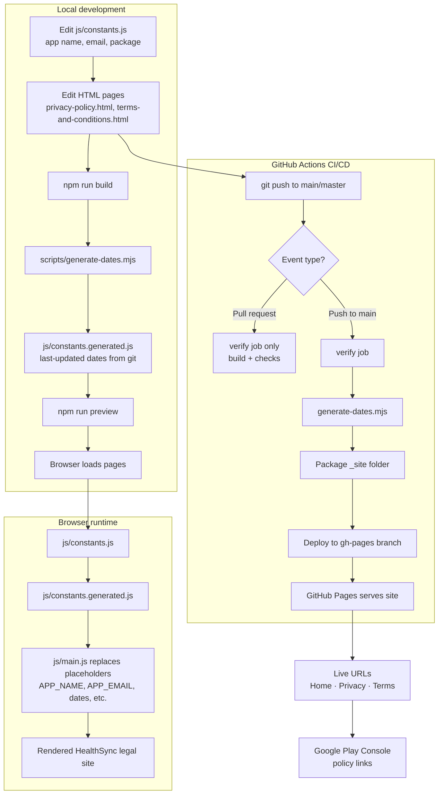

# HealthSync Legal Pages

Static **Privacy Policy** and **Terms & Conditions** pages for the [HealthSync](https://play.google.com/store/apps/details?id=com.health.sync) Android app (`com.health.sync`).

The site is built with plain **HTML + CSS + JavaScript** (no framework) and deploys automatically to **GitHub Pages** on every push to `main` / `master`.

---

## Live links

The site is live at:

| Page | URL |
|------|-----|
| **Home** | https://gmddev074.github.io/HealyhSyncPrivacyPolicy/ |
| **Privacy Policy** | https://gmddev074.github.io/HealyhSyncPrivacyPolicy/privacy-policy.html |
| **Terms & Conditions** | https://gmddev074.github.io/HealyhSyncPrivacyPolicy/terms-and-conditions.html |

Each GitHub Actions run also prints these URLs in the **Workflow summary** tab.

---

## Project flow



### Flow summary

| Stage | What happens |
|-------|----------------|
| **1. Configure** | Set branding in `js/constants.js` (name, email, Play Store package). |
| **2. Edit content** | Update legal text in `privacy-policy.html` and `terms-and-conditions.html`. |
| **3. Build** | `generate-dates.mjs` reads git history and writes `constants.generated.js`. |
| **4. Preview** | `npm run preview` serves the site locally with all placeholders filled. |
| **5. Push** | Commit and push to `main` — GitHub Actions runs automatically. |
| **6. Verify** | Workflow validates files and generated dates (runs on PRs too). |
| **7. Deploy** | On `main`, site files are published to the `gh-pages` branch. |
| **8. Publish** | GitHub Pages hosts the site at `gmddev074.github.io/HealyhSyncPrivacyPolicy/`. |
| **9. Use** | Copy Privacy Policy and Terms URLs into Google Play Console. |

---

## What this project does

1. **Legal pages** — Professional Privacy Policy and Terms & Conditions for HealthSync, suitable for Google Play Store compliance.
2. **Centralized branding** — App name, email, Play Store package, and URLs live in one `Constants` class (`js/constants.js`).
3. **Template placeholders** — HTML uses `{{APP_NAME}}`, `{{APP_EMAIL}}`, etc.; `js/main.js` replaces them at runtime.
4. **Automatic “Last Updated” dates** — Dates are **not** hard-coded. A build script reads **git history** and sets:
   - `PRIVACY_LAST_UPDATED` from the latest commit touching `privacy-policy.html`, `js/constants.js`, or `css/style.css`
   - `TERMS_LAST_UPDATED` from the latest commit touching `terms-and-conditions.html`, `js/constants.js`, or `css/style.css`
   - `COPYRIGHT_YEAR` from the current year at build time
5. **CI/CD** — GitHub Actions builds, verifies, and deploys to GitHub Pages. Pull requests run a **test build** without publishing.

---

## Project structure

```
.
├── .github/workflows/deploy-pages.yml   # GitHub Actions: build + deploy
├── .gitignore                           # Keeps secrets, generated files, and junk out of git
├── .nojekyll                            # Ensures GitHub Pages serves all files correctly
├── index.html                           # Landing page with links to legal docs
├── privacy-policy.html                  # Privacy Policy
├── terms-and-conditions.html            # Terms & Conditions
├── LICENSE                              # Copyright notice
├── css/style.css                        # Shared styles
├── js/
│   ├── constants.js                     # Manual config (edit this)
│   ├── constants.generated.js           # Auto-generated dates (do not commit)
│   └── main.js                          # Injects {{PLACEHOLDERS}} into pages
├── scripts/generate-dates.mjs           # Builds constants.generated.js from git
├── package.json                         # `npm run build` / `npm run preview`
└── README.md
```

---

## Configuration

Edit **`js/constants.js`** to change branding:

| Constant | Current value |
|----------|----------------|
| `APP_NAME` | HealthSync |
| `APP_EMAIL` | gmddev074@gmail.com |
| `PLAY_STORE_PACKAGE` | com.health.sync |
| `MIN_AGE` | 13 |
| `SERVICE_DESCRIPTION` | Health/wellness tracking description |

Do **not** edit `js/constants.generated.js` — it is recreated on every build.

---

## Local development

### Prerequisites

- Node.js **18+**

### Preview locally

```bash
npm run build    # Generate last-updated dates from git history
npm run preview  # Serve at http://localhost:4173
```

Open:

- http://localhost:4173/privacy-policy.html  
- http://localhost:4173/terms-and-conditions.html  

> If you open HTML files directly in the browser (`file://`), `constants.generated.js` may be missing. Always run `npm run build` first.

---

## GitHub Pages setup (one-time)

> **Private repository?** On the free GitHub plan, Pages only works for **public** repositories. If Settings → Pages shows *“Upgrade or make this repository public to enable Pages”*, you must either **make this repo public** or use a paid GitHub plan. For a Play Store privacy policy site, a **public repo is recommended** — the pages are public anyway.

1. Push this repository to GitHub and merge to `main` or `master`.
2. Wait for the **Deploy GitHub Pages** workflow to finish — it publishes site files to the `gh-pages` branch.
3. Go to **Settings → Pages → Build and deployment**.
4. Set **Source** to **Deploy from a branch**.
5. Choose branch **`gh-pages`**, folder **`/ (root)`**, then click **Save**.

Your site is live at:

https://gmddev074.github.io/HealyhSyncPrivacyPolicy/

> You only need to configure the branch once. Every future push to `main`/`master` updates `gh-pages` automatically.

### If you don’t see “Source” under Pages

| What you see | Cause | Fix |
|--------------|-------|-----|
| *“Upgrade or make this repository public to enable Pages”* | Repo is **private** on free plan | **Settings → General → Danger zone → Change visibility → Public** |
| No Pages tab at all | No admin access to the repo | Ask the repo owner to enable Pages or make you admin |
| Source appears but site 404 | `gh-pages` branch not created yet | Run the deploy workflow once, then pick `gh-pages` branch |

### Workflow behavior

| Event | What happens |
|-------|----------------|
| Push to `main` / `master` | Build → verify → **deploy** to GitHub Pages |
| Pull request | Build → verify → **no deploy** (test run only) |
| Manual | Run **Deploy GitHub Pages** from the Actions tab |

---

## How automatic dates work

When you change legal content and push:

1. GitHub Actions checks out the full git history (`fetch-depth: 0`).
2. `node scripts/generate-dates.mjs` inspects commit dates for watched files.
3. `js/constants.generated.js` is written with fresh dates.
4. The site (including generated file) is deployed.

**Watched files**

| Date field | Files |
|------------|-------|
| Privacy “Last Updated” | `privacy-policy.html`, `js/constants.js`, `css/style.css` |
| Terms “Last Updated” | `terms-and-conditions.html`, `js/constants.js`, `css/style.css` |

---

## What is ignored by git

`.gitignore` excludes generated artifacts, dependencies, secrets, OS/editor junk, logs, archives, and local tool folders so only source files are tracked. Notably:

- `js/constants.generated.js` (rebuilt in CI)
- `node_modules/`, lockfiles, `.env*`
- Editor folders (`.vscode/`, `.idea/`)
- OS files (`.DS_Store`, `Thumbs.db`)
- Temporary and backup files

---

## Play Store usage

Use these URLs in Google Play Console:

- **Privacy policy URL:** https://gmddev074.github.io/HealyhSyncPrivacyPolicy/privacy-policy.html
- **Terms URL (if required):** https://gmddev074.github.io/HealyhSyncPrivacyPolicy/terms-and-conditions.html

---

## License

Copyright © 2026 **HealthSync**. All rights reserved.

See [LICENSE](./LICENSE) for the full copyright notice.
